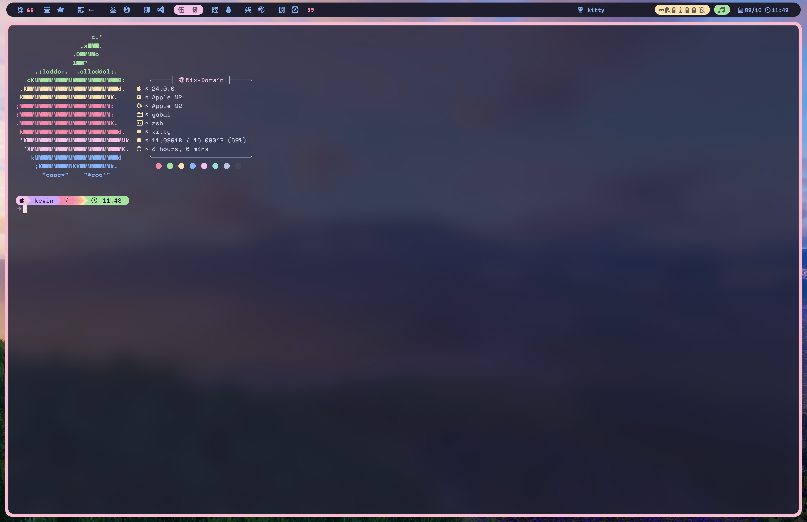
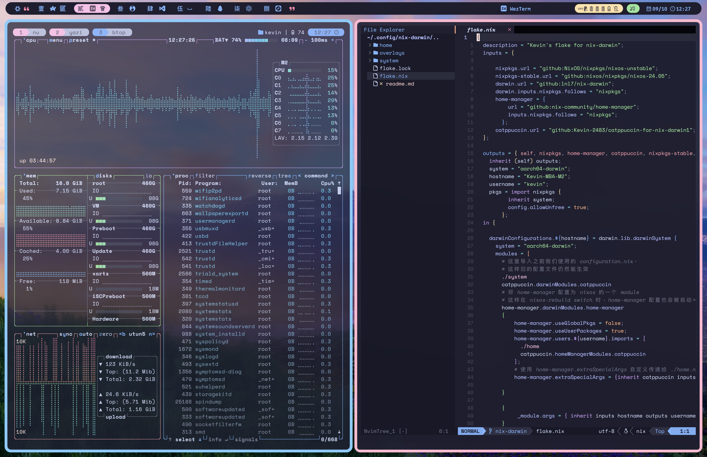

# 本人的 MacOS Nix-Darwin 配置

## screenshots

### 系統資訊

![ SystemInfo ] (./screenshot/systeminfo.png)

### Kitty終端

### tmux&btop&NeoVim

### yabai

## 一切皆Nix

系統的一切，從系統設定，到程式安裝，從環境變量，到用戶配置等等都由Nix管理。

> [!NOTE]
> homebrew 及 cask 也在nix-darwin的管理之下，但homebrew程式本身不由nix管理

> [!NOTE]
> App Store 安裝的程式由mas管理，mas并不会在你从列表中移除应用时自动从系统删掉安装过的Apple Apps

> [!Important]
> 在部分軟件中，一些時常我經常更新，或具有時效性的的配置由 WebDAV 管理，比如我使用WebDAV管理訂閱，同步Obsidian筆記，但這些軟件本身和配置由nix管理

> [!Important]
> 闭源软件一般由brew cask下载而不通过Nixpkgs下载来保证软件是最新的

使用flakes特性，来保证配置的统一，易读，便于扩展

## 终端

- [kitty](https://sw.kovidgoyal.net/kitty/)
- [weztem](https://wezfurlong.org/wezterm/)
- [tmux](https://github.com/tmux/tmux)

## shell

登入shell为zsh，与系统交互使用nushell，配置中向bash，zsh，nushell添加了完整的系统环境变量，包括nix，brew等。其中zsh和nushell使用[starship](https://starship.rs/)主题

> [!TIP]
> 初次构建后使用install_plugins 来进行插件安装

## Yazi

加入了一些常用插件

> [!TIP]
> 使用darwin-rebuild switch 切換到新的代之後需要使用`sudo ya pack -i`命令來安裝yazi插件

## 主题

[catppuccin](https://catppuccin.com/) mocha主题

## 视窗调度

使用[yabai](https://github.com/koekeishiya/yabai/tree/master)配合[skhd](https://github.com/koekeishiya/skhd)进行的视窗管理

> [!WARNING]
> 我關閉了系統完整性保護

> [!TIP]
> 使用darwin-rebuild switch切換到新的代之後需要使用yabai-reload命令來恢復使用cli控制yabai服務的功能

## 輸入法及語言

本配置中使用[中州韻](https://rime.im/)輸入引擎，[鼠鬚管](https://github.com/rime/squirrel)輸入法搭配[霧凇拼音](https://github.com/iDvel/rime-ice)和[微軟雙拼](https://github.com/rime/rime-double-pinyin)做中文輸入法

> [!IMPORTANT]
> 我的系統使用繁體中文作爲系統語言，部分配置和簡體中文應該不一樣，比如yabai規則。

> [!NOTE]
> 为什么有的时候我用简体有的时候用繁体，我不懂繁体中文，但我用繁体中文作为计算机和各种电子设备的显示语言七八年了，简体中文是我及我身边的人的母语，但我认为繁体中文更具汉字美感，并且更易读。在计算机上不用担心繁体中文难写所以我会选择在计算机上使用繁体中文，但书面表达偏向于大陆语境 ：）

> [!TIP]
> 进行系统代的建置和切换后需要点击重新部署

## skhd組合鍵

| 組合鍵                                                       | 功能                                |
| ------------------------------------------------------------ | ----------------------------------- |
| <kbd>Ctrl</kbd> + <kbd>Command</kbd> - h j k l               | 聚焦指定方位视窗                    |
| <kbd>Ctrl</kbd> + <kbd>Alt</kbd> - h j k l                   | 于指定方位视窗交换位置              |
| <kbd>Alt</kbd> - <kbd>Up</kbd>                               | 聚焦上一個显示器                    |
| <kbd>Alt</kbd> - <kbd>Down</kbd>                             | 聚焦下一個显示器                    |
| <kbd>Alt</kbd> - <kbd>Left</kbd>                             | 聚焦上一個Space                     |
| <kbd>Alt</kbd> - <kbd>Right</kbd>                            | 聚焦下一個Space                     |
| <kbd>Alt</kbd> - 數字鍵                                      | 聚焦至指定編號Space                 |
| <kbd>Alt</kbd> - <kbd>+</kbd>                                | 新增Space                           |
| <kbd>Alt</kbd> - <kbd>-</kbd>                                | 摧毁Space                           |
| <kbd>Alt</kbd> - <kbd>[</kbd>                                | 当前Space与上一個交换               |
| <kbd>Alt</kbd> - <kbd>]</kbd>                                | 当前Space与下一個交换               |
| <kbd>Alt</kbd> - <kbd>`</kbd>                                | 回到上一个Space                     |
| <kbd>Alt</kbd> + <kbd>Command</kbd> - b                      | 平衡Space中视窗分割                 |
| <kbd>Alt</kbd> + <kbd>Shift</kbd> - r                        | 旋轉Space                           |
| <kbd>Alt</kbd> + <kbd>Command</kbd> - r                      | 切換當前parent分割方向              |
| <kbd>Alt</kbd> + <kbd>Shift</kbd> - <kbd>Left</kbd>          | 移動聚焦視窗至上一個Space           |
| <kbd>Alt</kbd> + <kbd>Shift</kbd> - <kbd>Right</kbd>         | 移動聚焦視窗至下一個Space           |
| <kbd>Alt</kbd> + <kbd>Shift</kbd> - 數字鍵                   | 移動聚焦視窗到指定編號Space         |
| <kbd>Alt</kbd> + <kbd>Command</kbd> - z                      | 調整聚焦視窗大小以佔據整個parent    |
| <kbd>Alt</kbd> + <kbd>Shift</kbd> - z                        | 切換聚焦視窗至全屏模式              |
| <kbd>Alt</kbd> + <kbd>Command</kbd> - m                      | 切換聚焦視窗至懸浮模式              |
| <kbd>Ctrl</kbd> - 方向鍵                                     | 向指定方位拉伸聚焦視窗以放大之      |
| <kbd>Ctrl</kbd> + <kbd>Shift</kbd> - 方向鍵                  | 向指定方位擠壓聚焦視窗以縮小之      |
| <kbd>Command</kbd> + <kbd>Shift</kbd> - 方向鍵               | 向指定方位移動聚焦視窗              |
| <kbd>Alt</kbd> - a                                           | 打開應用Arc Browser                 |
| <kbd>Alt</kbd> - s                                           | 打開應用Spotify                     |
| <kbd>Alt</kbd> - t                                           | 執行指令 kitty                      |
| <kbd>Alt</kbd> - c                                           | 執行指令 code                       |
| <kbd>Alt</kbd> - f                                           | 打開應用Finder                      |
| <kbd>Alt</kbd> - w                                           | 打開應用WeChat                      |
| <kbd>Alt</kbd> - l                                           | 執行指令LocalSend                   |
| <kbd>Alt</kbd> - o                                           | 打開應用Obsidian                    |
| <kbd>Alt</kbd> - <kbd>return<kbd>                            | 打開應用WezTerm                     |
| <kbd>Alt</kbd> - x                                           | 打開WezTermGUI視窗並使用nu執行yabai |
| <kbd>Alt</kbd> - j                                           | 打開應用 計算機                     |
| <kbd>Alt</kbd> - z                                           | 執行指令 Zed                        |

## 不要在没读懂的情况下直接套用我的配置

虽然理论上只要改一些变量名这个配置就可以在任何darwin的电脑上运行，但是这可能不适合你

## 未来可能增加的功能

使用[matugen](https://github.com/InioX/matugen)等工具自动生产系统配色
